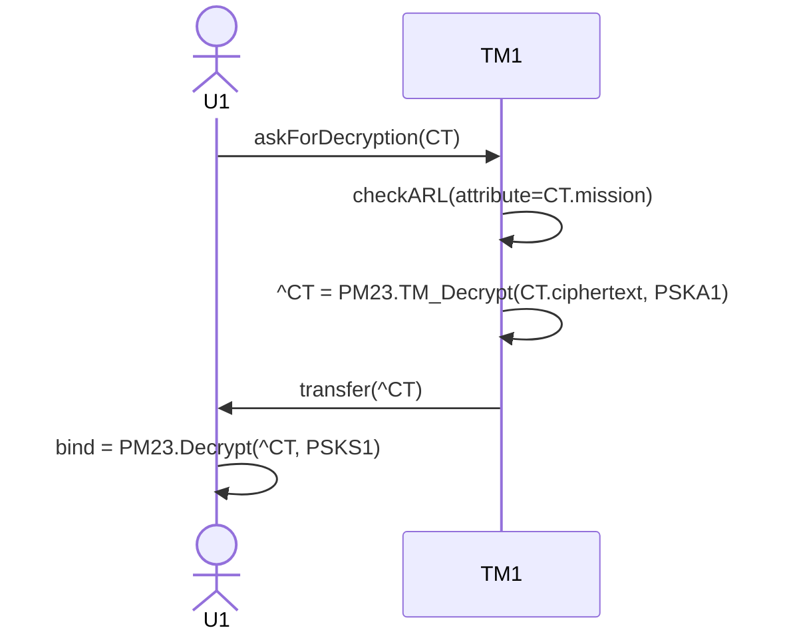

```mermaid
sequenceDiagram
    actor U1
    
    U1->>TM1: askForDecryption(CT)
    TM1->>TM1: checkARL(attribute=CT.mission)

    TM1->>TM1: ^CT = PM23.TM_Decrypt(CT.ciphertext, PSKA1)

    TM1->>U1: transfer(^CT)

    U1->>U1: bind = PM23.Decrypt(^CT, PSKS1)
```