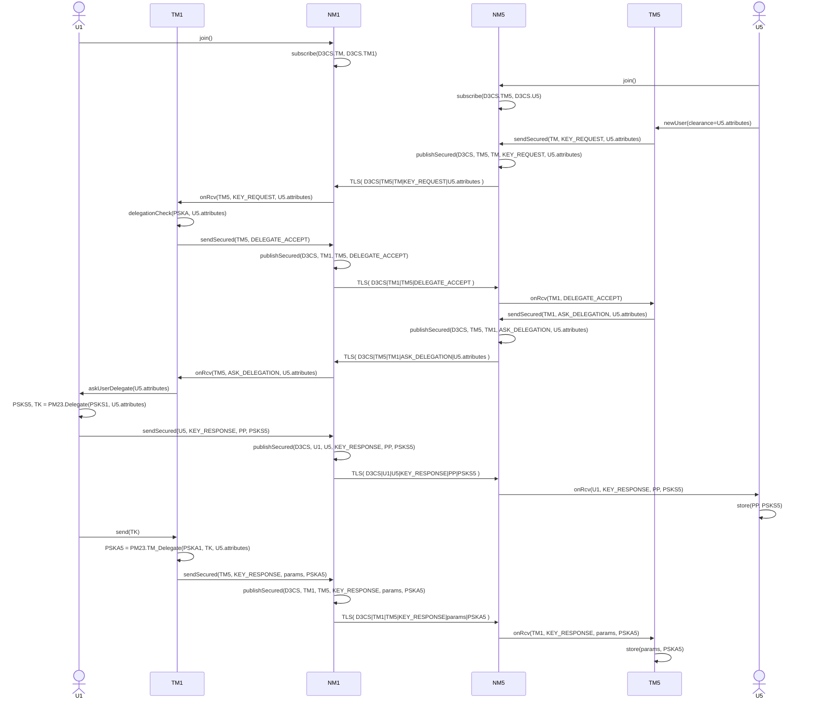

```mermaid
sequenceDiagram
    actor U1
    participant TM1
    participant NM1
    participant NM5
    participant TM5
    actor U5

    U1->>NM1: join()
    NM1->>NM1: subscribe(D3CS.TM, D3CS.TM1)
    U5->>NM5: join()
    NM5->>NM5: subscribe(D3CS.TM5, D3CS.U5)

    U5->>TM5: newUser(clearance=U5.attributes)
    TM5->>NM5: sendSecured(TM, KEY_REQUEST, U5.attributes)
    NM5->>NM5: publishSecured(D3CS, TM5, TM, KEY_REQUEST, U5.attributes)
    NM5->>NM1: TLS( D3CS|TM5|TM|KEY_REQUEST|U5.attributes )
    NM1->>TM1: onRcv(TM5, KEY_REQUEST, U5.attributes)
    TM1->>TM1: delegationCheck(PSKA, U5.attributes)

    TM1->>NM1: sendSecured(TM5, DELEGATE_ACCEPT)
    NM1->>NM1: publishSecured(D3CS, TM1, TM5, DELEGATE_ACCEPT)
    NM1->>NM5: TLS( D3CS|TM1|TM5|DELEGATE_ACCEPT )
    NM5->>TM5: onRcv(TM1, DELEGATE_ACCEPT)
    
    TM5->>NM5: sendSecured(TM1, ASK_DELEGATION, U5.attributes)
    NM5->>NM5: publishSecured(D3CS, TM5, TM1, ASK_DELEGATION, U5.attributes)
    NM5->>NM1: TLS( D3CS|TM5|TM1|ASK_DELEGATION|U5.attributes )
    NM1->>TM1: onRcv(TM5, ASK_DELEGATION, U5.attributes)
    TM1->>U1: askUserDelegate(U5.attributes)

    U1->>U1: PSKS5, TK = PM23.Delegate(PSKS1, U5.attributes)

    U1->>NM1: sendSecured(U5, KEY_RESPONSE, PP, PSKS5)
    NM1->>NM1: publishSecured(D3CS, U1, U5, KEY_RESPONSE, PP, PSKS5)
    NM1->>NM5: TLS( D3CS|U1|U5|KEY_RESPONSE|PP|PSKS5 )
    NM5->>U5: onRcv(U1, KEY_RESPONSE, PP, PSKS5)
    U5->>U5: store(PP, PSKS5)

    U1->>TM1: send(TK)

    TM1->>TM1: PSKA5 = PM23.TM_Delegate(PSKA1, TK, U5.attributes)

    TM1->>NM1: sendSecured(TM5, KEY_RESPONSE, params, PSKA5)
    NM1->>NM1: publishSecured(D3CS, TM1, TM5, KEY_RESPONSE, params, PSKA5)
    NM1->>NM5: TLS( D3CS|TM1|TM5|KEY_RESPONSE|params|PSKA5 )
    NM5->>TM5: onRcv(TM1, KEY_RESPONSE, params, PSKA5)
    TM5->>TM5: store(params, PSKA5)

```