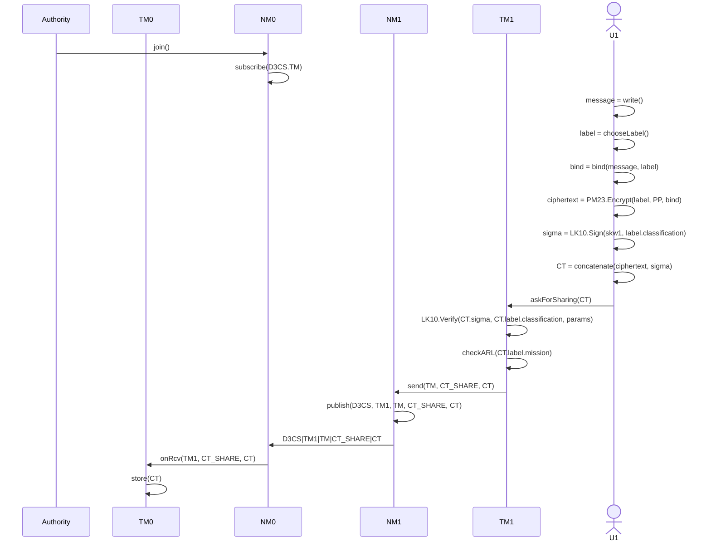

```mermaid
sequenceDiagram
    participant Authority
    participant TM0
    participant NM0
    participant NM1
    participant TM1
    actor U1

    Authority->>NM0: join()
    NM0->>NM0: subscribe(D3CS.TM)
    
    U1->>U1: message = write()
    U1->>U1: label = chooseLabel()

    U1->>U1: bind = bind(message, label)

    U1->>U1: ciphertext = PM23.Encrypt(label, PP, bind)
    U1->>U1: sigma = LK10.Sign(skw1, label.classification)

    U1->>U1: CT = concatenate(ciphertext, sigma)

    U1->>TM1: askForSharing(CT)

    TM1->>TM1: LK10.Verify(CT.sigma, CT.label.classification, params)

    TM1->>TM1: checkARL(CT.label.mission)

    TM1->>NM1: send(TM, CT_SHARE, CT)
    NM1->>NM1: publish(D3CS, TM1, TM, CT_SHARE, CT)
    NM1->>NM0: D3CS|TM1|TM|CT_SHARE|CT
    NM0->>TM0: onRcv(TM1, CT_SHARE, CT)
    TM0->>TM0: store(CT)
    

```