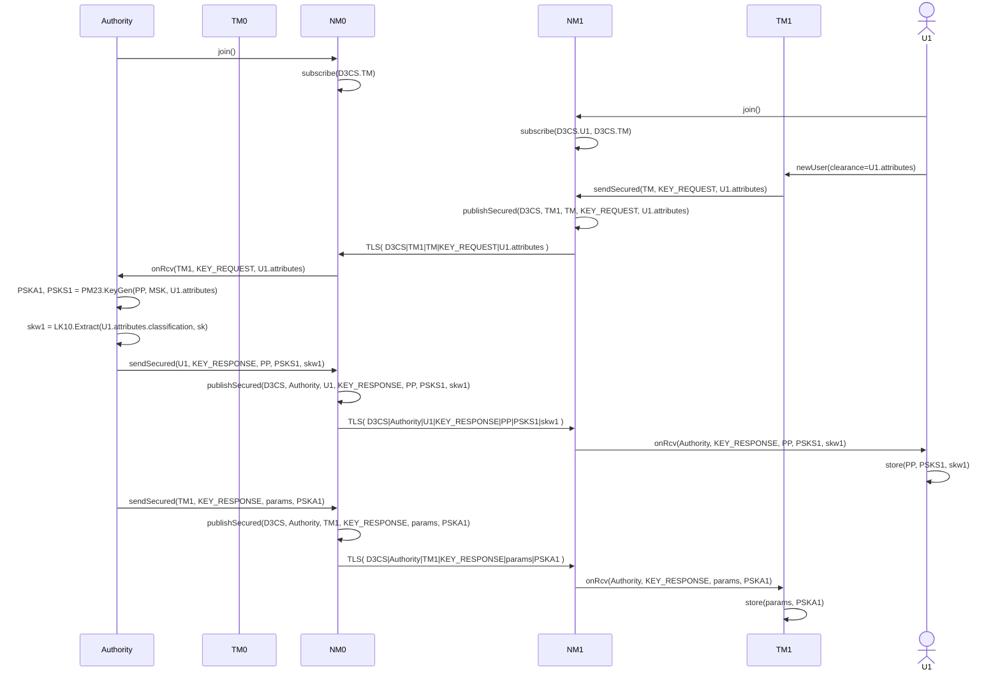

```mermaid
sequenceDiagram
    participant Authority
    participant TM0
    participant NM0
    participant NM1
    participant TM1
    actor U1

    Authority->>NM0: join()
    NM0->>NM0: subscribe(D3CS.TM)
    U1->>NM1: join()
    NM1->>NM1: subscribe(D3CS.U1, D3CS.TM)

    U1->>TM1: newUser(clearance=U1.attributes)
    TM1->>NM1: sendSecured(TM, KEY_REQUEST, U1.attributes)
    NM1->>NM1: publishSecured(D3CS, TM1, TM, KEY_REQUEST, U1.attributes)
    NM1->>NM0: TLS( D3CS|TM1|TM|KEY_REQUEST|U1.attributes )
    NM0->>Authority: onRcv(TM1, KEY_REQUEST, U1.attributes)

    Authority->>Authority: PSKA1, PSKS1 = PM23.KeyGen(PP, MSK, U1.attributes) 
    Authority->>Authority: skw1 = LK10.Extract(U1.attributes.classification, sk)
    
    Authority->>NM0: sendSecured(U1, KEY_RESPONSE, PP, PSKS1, skw1)
    NM0->>NM0: publishSecured(D3CS, Authority, U1, KEY_RESPONSE, PP, PSKS1, skw1)
    NM0->>NM1: TLS( D3CS|Authority|U1|KEY_RESPONSE|PP|PSKS1|skw1 )
    NM1->>U1: onRcv(Authority, KEY_RESPONSE, PP, PSKS1, skw1)
    U1->>U1: store(PP, PSKS1, skw1)

    Authority->>NM0: sendSecured(TM1, KEY_RESPONSE, params, PSKA1)
    NM0->>NM0: publishSecured(D3CS, Authority, TM1, KEY_RESPONSE, params, PSKA1)
    NM0->>NM1: TLS( D3CS|Authority|TM1|KEY_RESPONSE|params|PSKA1 )
    NM1->>TM1: onRcv(Authority, KEY_RESPONSE, params, PSKA1)
    TM1->>TM1: store(params, PSKA1)
```