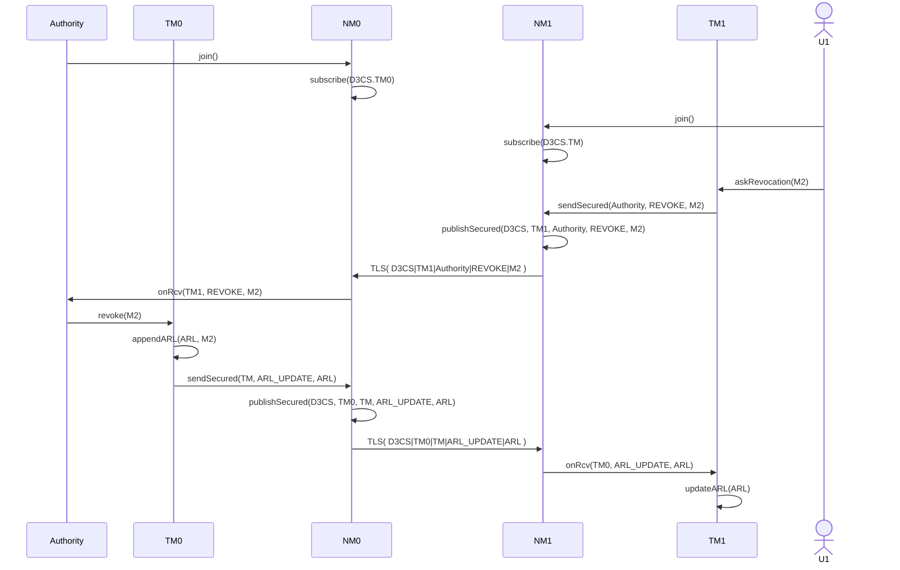

```mermaid
sequenceDiagram
    participant Authority
    participant TM0
    participant NM0
    participant NM1
    participant TM1
    actor U1

    Authority->>NM0: join()
    NM0->>NM0: subscribe(D3CS.TM0)
    U1->>NM1: join()
    NM1->>NM1: subscribe(D3CS.TM)

    U1->>TM1: askRevocation(M2)
    TM1->>NM1: sendSecured(Authority, REVOKE, M2)
    NM1->>NM1: publishSecured(D3CS, TM1, Authority, REVOKE, M2)
    NM1->>NM0: TLS( D3CS|TM1|Authority|REVOKE|M2 )
    NM0->>Authority: onRcv(TM1, REVOKE, M2)
    Authority->>TM0: revoke(M2)
    TM0->>TM0: appendARL(ARL, M2)
    TM0->>NM0: sendSecured(TM, ARL_UPDATE, ARL)
    NM0->>NM0: publishSecured(D3CS, TM0, TM, ARL_UPDATE, ARL)
    NM0->>NM1: TLS( D3CS|TM0|TM|ARL_UPDATE|ARL )
    NM1->>TM1: onRcv(TM0, ARL_UPDATE, ARL)
    TM1->>TM1: updateARL(ARL)

```