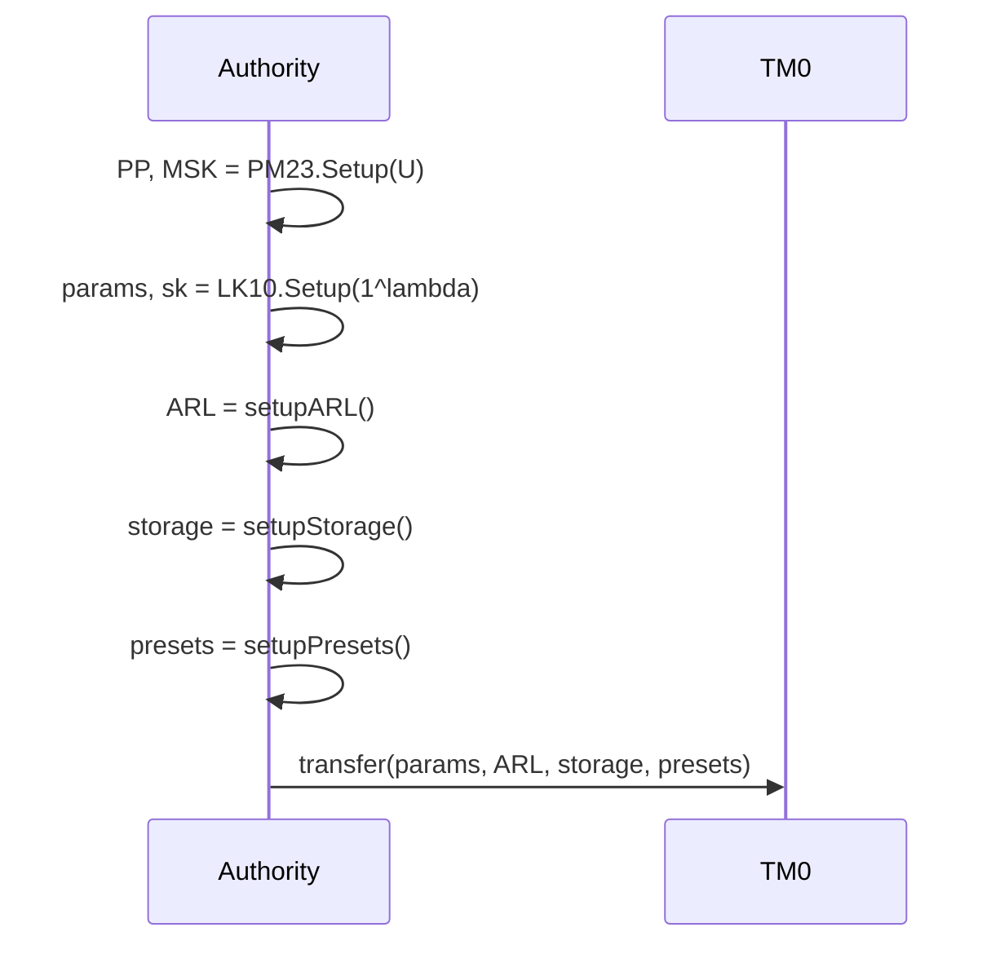

```mermaid
sequenceDiagram
    Authority->>Authority: PP, MSK = PM23.Setup(U) 
    Authority->>Authority: params, sk = LK10.Setup(1^lambda)
    Authority->>Authority: ARL = setupARL()
    Authority->>Authority: storage = setupStorage()
    Authority->>Authority: presets = setupPresets()
    Authority->>TM0: transfer(params, ARL, storage, presets)
```