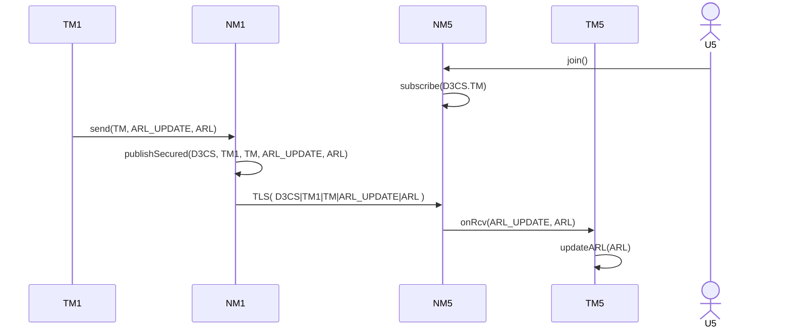

```mermaid
sequenceDiagram
    participant TM1
    participant NM1
    participant NM5
    participant TM5
    actor U5

    U5->>NM5: join()
    NM5->>NM5: subscribe(D3CS.TM)

    TM1->>NM1: send(TM, ARL_UPDATE, ARL)
    NM1->>NM1: publishSecured(D3CS, TM1, TM, ARL_UPDATE, ARL)
    NM1->>NM5: TLS( D3CS|TM1|TM|ARL_UPDATE|ARL )
    NM5->>TM5: onRcv(ARL_UPDATE, ARL)
    TM5->>TM5: updateARL(ARL)

```