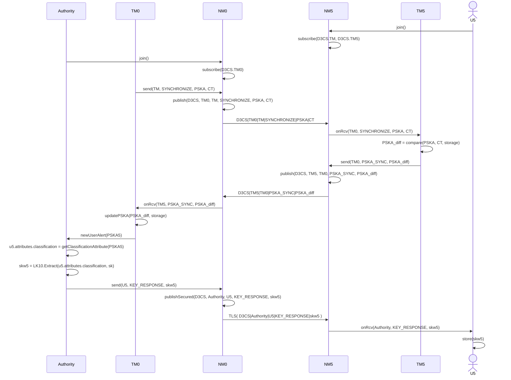

```mermaid
sequenceDiagram
    participant Authority
    participant TM0
    participant NM0
    participant NM5
    participant TM5
    actor U5

    U5->>NM5: join()
    NM5->>NM5: subscribe(D3CS.TM, D3CS.TM5)
    Authority->>NM0: join()
    NM0->>NM0: subscribe(D3CS.TM0)

    TM0->>NM0: send(TM, SYNCHRONIZE, PSKA, CT)
    NM0->>NM0: publish(D3CS, TM0, TM, SYNCHRONIZE, PSKA, CT)
    NM0->>NM5: D3CS|TM0|TM|SYNCHRONIZE|PSKA|CT
    NM5->>TM5: onRcv(TM0, SYNCHRONIZE, PSKA, CT)
    TM5->>TM5: PSKA_diff = compare(PSKA, CT, storage)
    TM5->>NM5: send(TM0, PSKA_SYNC, PSKA_diff)
    NM5->>NM5: publish(D3CS, TM5, TM0, PSKA_SYNC, PSKA_diff)
    NM5->>NM0: D3CS|TM5|TM0|PSKA_SYNC|PSKA_diff
    NM0->>TM0: onRcv(TM5, PSKA_SYNC, PSKA_diff)
    TM0->>TM0: updatePSKA(PSKA_diff, storage)

    TM0->>Authority: newUserAlert(PSKA5)

    Authority->>Authority: u5.attributes.classification = getClassificationAttribute(PSKA5)
    Authority->>Authority: skw5 = LK10.Extract(u5.attributes.classification, sk)

    Authority->>NM0: send(U5, KEY_RESPONSE, skw5)
    NM0->>NM0: publishSecured(D3CS, Authority, U5, KEY_RESPONSE, skw5)
    NM0->>NM5: TLS( D3CS|Authority|U5|KEY_RESPONSE|skw5 )
    NM5->>U5: onRcv(Authority, KEY_RESPONSE, skw5)
    U5->>U5: store(skw5)


```