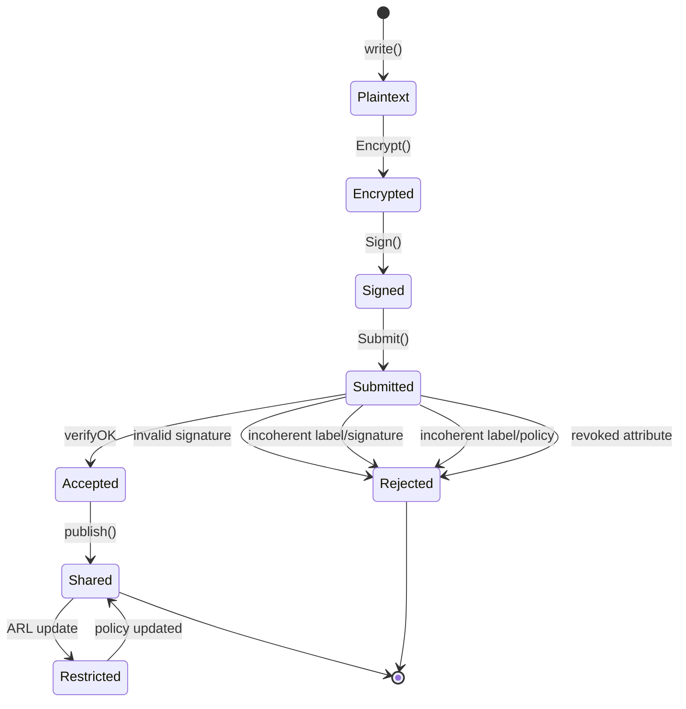

```mermaid
stateDiagram-v2
    [*] --> Plaintext : write()

    Plaintext --> Encrypted : Encrypt()
    Encrypted --> Signed : Sign()
    Signed --> Submitted : Submit()

    Submitted --> Accepted : verifyOK
    Submitted --> Rejected : invalid signature
    Submitted --> Rejected : incoherent label/signature
    Submitted --> Rejected : incoherent label/policy
    Submitted --> Rejected : revoked attribute

    Accepted --> Shared : publish()

    Shared --> Restricted : ARL update
    Restricted --> Shared : policy updated

    Shared --> [*]
    Rejected --> [*]
```